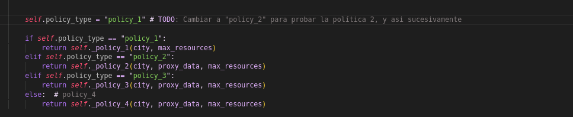

# Zombie Extraction Simulator
La documentacion completa se encuentra en 'docs/'. Tienes que leerla toda.

## Empezar
0. Lee la guia para debugging y use de IA `docs/a_guia_debugging.md`
1. Tener las cosas necesarias instaladas, lee detalladamente 'docs/00_requerimientos_tecnicos.md'
2. Asegurate de poder ejecutar el codigo base para saber que todo esta en order 'docs/01_ejecutar_prueba.md'
3. Asegurate de entender las partes del codigo 'docs/02_guia_codigo.md'
4. Entiende los inputs y los outputs lee `docs/03_guia_de_datos`
    4.1 Lee la guia para el tipo de dato `nx.Graph` que se menciona en la guia `docs/03_guia_de_datos`. Esta guia se llama `docs/b_tutorial_nx.md`
5. Lee la de `docs/04_outputs_metricas.md` que contiene los outputs y metricas de las simulaciones, te explica lo que vez en la carpeta de `data/experiments`. ** En construccion**
6. Lee la `docs/descripcion_problema.md` para obtener inspiracion.
7. Lee la guia `docs/04_outputs.md` para entender los outputs de las simulaciones.
8. Lee la guia para el proxy `docs/05_guia_proxy.md` para entender como se recopilan los datos para la simulacion.
9. Entiende corectamente como funcionan el algoritmo, a detalle y analiza los resultados, a aprtir de ahi puedes empezar a mejorarlo.

## Ejercicios de Examen

Lee todos la documentación y asegúrate de entender bien los conceptos y cómo funciona el código. Después, implementa 4 estrategias que representen diferentes escenarios de la crisis:

### Entregables
- **Implementación**: 
  - Código principal en `public/student_code/solution.py`
  - Código auxiliar en `public/student_code/` (funciones de ayuda, utilidades, etc.)
  - Todo el código debe estar documentado y ser replicable
  
- **Documentación y Análisis**: Notebook en `public/student_code/examen_1.ipynb` que incluya:
  1. **Descripción de Políticas**:
     - Explicación detallada de cada estrategia
     - Justificación de decisiones de diseño
     - Pseudocódigo o diagramas de flujo (pueden usar mermaid y subir imagenes, o hacerlo a mano y subir las imagenes o fotos)
     - Analisis de la politica desde la perspectiva de probabilidad de Jaynes y su robot. Cuales son los supuestos de cada modelo, que estan asumiendo.
     - Analisis de su politica pensando en que es buena y en que es mala.

  2. **Análisis de Resultados**:
     - Simulaciones con 100 ciudades (20-50 nodos)
     - Análisis del archivo `core_metrics.csv` para cada política
     - Comparación detallada entre políticas
     - Gráficas y visualizaciones relevantes
     - Análisis de casos de éxito y fracaso

  3. **Justificación de Métricas**:
     - Métricas seleccionadas como relevantes
     - Por qué son importantes para el problema
     - Cómo se relacionan con el éxito de la misión
     - Ejemplos concretos de su uso

  4. **Propuestas de Mejora**:
     - Basadas en el análisis de resultados
     - Específicas para cada política
     - Consideraciones para implementación futura

### Replicabilidad
- Todo el código debe ser ejecutable con solo copiar los archivos en `public/student_code/`
- Cualquier dependencia adicional debe estar documentada
- Los resultados deben ser reproducibles con los mismos parámetros
- El notebook debe ejecutarse de principio a fin sin errores

### Entrega
Puede ser en su repositorio de github, o el notebook donde analizan las politicas en colab (asegurense de que se pueda ejecutar el notebook, esto incluye subir los core_metrics.csv para cada experimento). Si no corre en colab no sera aceptado bajo ninguna circunstancia, para subir los csv a colab pueden copiar y pegar los resultados directamente en codigo, subirlo a github y leerlo o alguna otra estrategia. Sin embargo, tiene que ejecutarse sin problema. Ademas en caso de subir un colab y no a github deben subir en un drive que es publico todo el codigo de `public/student_code` para que lo visualize. Asegurense que sea publico y lo pueda ver.

Cualquier falta a esto resultara en una nota de 0 sin excepciones.

### Las Cuatro Etapas de la Crisis

#### Política 1: Los Primeros Días
En las primeras horas después del incidente, operamos completamente a ciegas. No tenemos sensores, no hay datos de la situación, solo el mapa básico de la ciudad y nuestra experiencia. Esta política representa cómo los primeros equipos de rescate tuvieron que operar basándose únicamente en la estructura de la ciudad.

**Contexto**: Primera respuesta al desastre
**Datos Disponibles**: Solo información estructural de la ciudad
**Objetivo**: Establecer protocolos básicos de evacuación

**Restricciones**:
- NO usar datos de proxies
- Solo información básica del grafo (nodos, aristas, pesos)
- Inputs permitidos: `city.graph`, `city.starting_node`, `city.extraction_nodes`, `max_resources`

#### Política 2: Estableciendo la Red de Monitoreo
Después de las primeras semanas, logramos establecer una red básica de sensores y recopilar información de supervivientes. No tenemos datos históricos, pero nuestros expertos han aprendido a interpretar las lecturas de los sensores. Esta política representa cómo los equipos operan usando esta nueva información.

**Contexto**: Establecimiento de sistemas de monitoreo
**Datos Disponibles**: Lecturas de sensores y conocimiento experto
**Objetivo**: Incorporar información ambiental en decisiones

**Restricciones**:
- Usar SOLO información de `docs/05_guia_proxy.md`
- NO usar datos de simulaciones previas
- Inputs permitidos: Los de Política 1 más `proxy_data.node_data` y `proxy_data.edge_data`

#### Política 3: Aprendiendo de la Experiencia
Han pasado meses. Tenemos datos de cientos de misiones, exitosas y fallidas. No tenemos modelos sofisticados, pero hemos identificado patrones y aprendido de nuestros errores. Esta política representa cómo los equipos utilizan este conocimiento acumulado.

**Contexto**: Análisis de datos históricos
**Datos Disponibles**: Registros de misiones previas
**Objetivo**: Mejorar decisiones basadas en experiencia previa

**Restricciones**:
- Usar datos de simulaciones previas
- Solo estadísticas básicas
- NO usar machine learning
- Inputs permitidos: Todos los anteriores más datos históricos

#### Política 4: Simulación de Entrenamiento
Esta es una política de prueba para entrenar nuevos equipos. No representa una situación real, sino un ambiente de aprendizaje donde podemos experimentar con diferentes estrategias sin restricciones.

**Contexto**: Ambiente de entrenamiento y experimentación
**Datos Disponibles**: Todos los recursos
**Objetivo**: Explorar estrategias óptimas sin restricciones

**Restricciones**: Ninguna
**Objetivo**: Implementar la mejor estrategia posible para entender el problema completo

### Criterios de Evaluación
1. **Implementación**:
   - Código correcto y eficiente
   - Manejo de errores
   - Cumplimiento de restricciones
   - Replicabilidad del código

2. **Análisis**:
   - Justificación clara de decisiones
   - Análisis comparativo de resultados
   - Selección y justificación de métricas relevantes
   - Propuestas de mejora basadas en evidencia
   - Calidad de visualizaciones y comparaciones

### Notas
- El archivo `run_bulk_simulations.py` ejecuta 100 simulaciones para la politica especificada en el archivo `solution.py`.
- Puedes cambiar la política que se está probando en el archivo `solution.py`. Cambia el valor de la variable `self.policy_type` en el archivo `solution.py` para probar una política diferente.

- El archivo `core_metrics.csv` contiene las métricas principales de las simulaciones. (lee la documentación para entender que significan)
