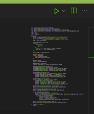

# Ejecutar Prueba
Despues de realizar todos los pasos de la guia 'docs/00_requerimientos_tecnicos.md' puedes proseguir con esta

## Abrir Folder
Desde VSCode abre el folder donde hayas descargado (y descomprimido en su defecto) el repositorio de la clase. Para abrirlo ve a las opciones de VSCode, da click en 'File' y debe haber la opcion de 'Open Folder' ('Abrir Folder'?),
da click y te abrira el el folder completo del repositorio. Asegura de abrir ese exactamente, no un directorio arriba u abajo, siempre ese.

## Instalar Librerias
[Video](https://www.youtube.com/watch?v=GZbeL5AcTgw) de como instalar las paqueterias de python usando VSCode.  
Para poder usar el codigo debes de instalar las librerias que se necesitan. Todas las librerias necesarias se encuentran en el `requirements.txt`. Este archivo es el default de pip-python para instalar librerias.  
1. Desde VSCode ejecuta (Ctrl + Shift + P), y busca 'Create Environment'.  
2. Elije (venv), trata de evitar Conda a menos que ya sepas como usarlo.  
2.1 Puede que te pregunte si deseas 'USe Existing' o 'Delete and Recreate'. Usa 'Delete and Recreate' para que sobreescriba lo que sea que tengas instalado ahora.
3. Selecciona el interprete de python que deseas (es el que instalaste previamente).  
4. Te va a desplegar opciones elige el `requierements.txt`, ques es el de este repositorio. VSCode automaticamente busca archivos en tu repositorio y los propone como candidatos para instalar librerias.  
5. Acepta y se empezara a instalar las paqueterias necesarias.  
  
## Ejecutar codigo
En estricto sentido el unico codigo que necesitas modificar para estos ejercicios es `run_bulk_simulations.py` o `run_simulation.py` que se encuentra en le directorio raiz del repositorio.  
Para ejecutarlo tienes dos opciones desde la terminal activando tu environment primero (.venv) o usando VSCode.  
PAra hacerlo usando VSCode basta con abrir el archivo y darle click al boton de play en la esquina superior derecha.  
  
+ Primero ejecuta `run_simulation.py` para asegurate que todo esta bien. Debera de producirte unas imagenes.  
+ Despues ejecuta  `run_bulk_simulations.py`  
En ambos casos deberas de ver unos prints en la terminal de VSCode para indicarte si esta bien. Utiliza tu criterio para saber si existen bugs o problemas.  
### Errores Comunes
Si te da un error que indica que no tienes un modulo que incluye la ruta o menciona algo parecido a 'xxx.lib.xxx' probablemente tengas una version vieja del repositorio asi que que actualizala usando github o descargando la version nueva si lo hiciste por zip.
### Errores de ciertas librerias faltantes  
Probablemente no se instalaron las librerias correctamente (o falta instalarlas). Repite los pasoss de instalacion de librerias. Si no funciona utiliza chatgpt pegando y compiando el error que te aprece en la terminal.  
