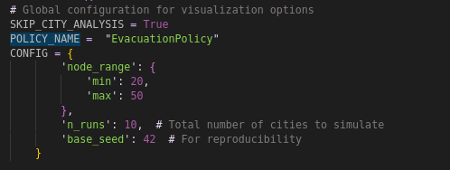
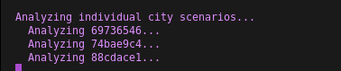

# Guia del codigo del Repositorio  
Ahora hay que entender las partes del codigo y repositorio actual.  

## Scripts de python
Solo existen 3 scripts de `.py` que van a necesitar modificar.  
1. `public/student_code/solution.py` es donde pueden probar sus diferentes `policies` u `acciones`. Este es donde deben crear su sistema de de IA.
1.1 Pueden agregar mas scripts que este script mande a llamar si asi lo desean. Por ejemplo pueden separar el codigo que crea el path en otro, y crear otros scripts con heuristicas. Solo asegurense de tener la logica completa en este script.
2. `run_simulation` este script ejecuta una simulacion (produciendo un ejemplo grafico) para una ciudad. Realmente no lo tienen que modificar nunca.  
3. `run_bulk_simulations.py` este script genera varias simulaciones. No lo tienen que tocar nunca salvo para aumentar el numero de simulaciones o indicar que no genere graficos.
3.1 PAra aumentar el numero de simulaciones que ejecuta pueden cambiar el config:  
   

   
   + Pueden aumentar el numero de simulaciones a ejecutar con `n_runs` .
   + `base_seed`: cambia la semilla aleatoria para producir nuevos escenarios. 
   + `node_range`: acota el tamanno de la ciudad.  

3.2 Hasta arriba tambien hay una variable global llamada `SKIP_CITY_ANALYSIS`. Si es igual a `False` va a generar visualizaciones **por ciudad** despues de ejecutar las simulaciones (identicas a las generadas por `run_simulation.py`). Si utilizan igual a `True` ejecutara todas las simulaciones, y creara las visualizaciones y analisis agregados, pero no las visualizacione individuales. La recomendacion es que al inicio ejecuten unas cuantas simulaciones con visualizaciones completas, despues muchas simulaciones sin visualizacion para que ver los resultados agregados. Las visualizaciones son para entender algunos casos a detalle, pero para probar el algoritmo de verdad no las necesitas por lo que desactivarlas apra hacer eficiente el codigo es lo mejor.  La imagen que sigue muestra como se ve cuando esta creando el analisis especializado por ciudad.
  
  
3.3 Existe otra variable que se llama `POLICY_NAME` (por default igual a`EvacuationPolicy`). Esta variable deben cambiarla si desean evaluar otro policy diferente al que tienen. recuerden que el policy esta definido por el codigo que tienen en  `public/tools/simulator.py`. Los archivos para cada simualcion se guardan en `data/policies/{POLICY_NAME}/experiments/{timestamp}`. De manera que si ejecutan el script siempre los va a guardar bajo el nombre del policy y le pegara el timestamp para evitar que sobreescribir simulaciones. Recuerden que si cambian cosas en su policy, pero no cambian el nombre del policy `POLICY_NAME` se va a guardar bajo la misma carpeta pero con un diferente timestamp, tomen encuenta eso.

## Que esperar
Mi recomendacion es que utilizen `run_bulk_simulations.py` con ciudades pequenas (pocos nodos) y unos 10 experimentos para entender como funciona el problema y su estructura. 
Cuando ejecutan el script de las simulaciones se ejecutan las simulaciones, se guardan los datos de la simulacion en la carpeta del experimento, se crean estadisitcos agregados y visualizaciones.  
El objetivo es usar esto para entender que esta pasando, de esta manera pueden evaluar y mejorar su politica. Esto es un proceso iterativo.  