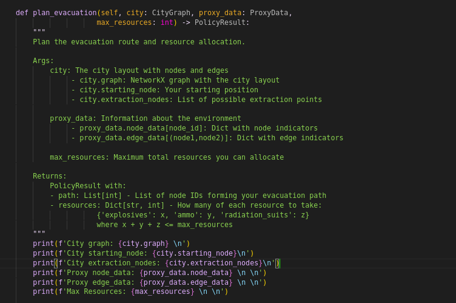
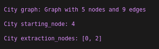
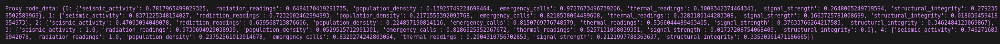
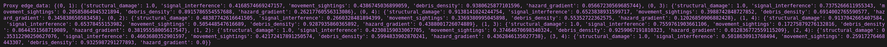
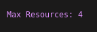
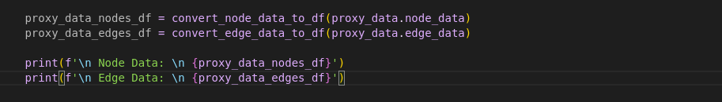
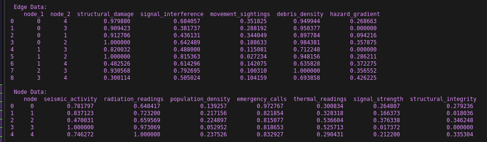

# Guia de datos
Al ejecutar las simulaciones se generan datos que su algoritmo va recibir (definen el escenario apra este evento o simulacion de ciduad), datos de la simulacion y resultados. En esta guia vamos a repasar cada uno de ellos.

## Datos de Input
La estructura de codigo de los inputs lo pueden ver al inicio de la funcion de `plan_evacuation` en el `solution.py`.  

Su algoritmo en `public/tools/simulator.py` recibira 3 datos (variables input):
1. `city [Objeto con networkx y otros valores]`, representa lo que conocemos de la ciudad. Conexiones entre nodos de la ciudad, nodo inicial, y nodos de extraccion.
1.1 `city.graph [nx.Graph]`: Es un archivo de tipo `networkx` que es la libreria de grafos mas usada en python. [Video Introductorio a NetworkX](https://www.youtube.com/watch?v=flwcAf1_1RU). Representa las conecciones **"esperadas"** de la ciudad.La ventaja de utilizar este objeto es que pueden aplicar algoritmos, metodos o lo que deseen the la libreria `networkx` sin necesidad de hacer el codigo manualmente, esto incluye visualizaciones y otras cosas interesantes. Esto se ve reflejado en el algoritmo `Naive` que se proporciona de inicio, ya que usamos el metodo de esta libreria para calcular el **shrotest** path de manera automatica sobre este objeto. Mi recomendacion es que utilicen esta estructura y esta libreria para ejecutar sus algoritmos, sin embargo pueden convertirla a una **linked_list** y usar las cosas de manera manual. Para entender mejor que puedes hacer con este objecto lee la documentacion 'docs/b_tutorial_nx.md'.
  
1.2 `city.starting_node [Dict]`: es un entero que representa el nodo donde empezaran su equipo al que tienen que extraer.
1.3 `city.extraction_nodes [Dict]`: es una lista con los nodos que son de extraccion. tienen que llegar a cualquiera de los dos para que la extraccion se de como valida.  
  
2. `proxy_data [Objeto de Diccionarios]`: es un diccionario (json) que contiene los proxies o datos que reflejan las condiciones o el estado de la ciudad o grafica.
2.1 `proxy_data.node_data [Dict]`: So los datos relacionados al **nodo**, la llave es el nodo, y el diccionario las variables y los valores para cada nodo. `{'nodo':{'caracteristica':'valor'}}`. Son las caracteristicas que conocemos del lugar.
```
 proxy_data.node_data ={ 
    '0': 
        {'caracteristica_1':valor, ..., 'caracteristica_n':valor},
    ...,
    `n`:
        {'caracteristica_1':valor, ..., 'caracteristica_n':valor}
 }
```

2.2 `proxy_data.edge_data [Dict]]`: Son los datos relacionados al **edge**, la llave es una tupla que representa la conexion entre dos nodos **(nodo1, nodo2)**, y el diccionario las variables y los valores para cada nodo. `{'(nodo1, nodo2)':{'caracteristica':'valor'}}`. Son las caracteristicas que conocemos de las calles o conecciones entre los nodos.
```
 proxy_data.edge_data ={ 
    '(0,20)': 
        {'caracteristica_1':valor, ..., 'caracteristica_n':valor},
    ...,
    `(n,m)`:
        {'caracteristica_1':valor, ..., 'caracteristica_n':valor}
 }
```  

3. `max_resources [int]`: Es el numero maximo de recursos que pueden cargar las personas que seran extraidas en esta ciudad. Puede variar, no es fijo.
  

### Dataframe
Adicionalmente se te proporciona una funcion que dado los inputs en JSON los convierte a un DataFrame de pandas por si deseas usarlo asi en vez de JSON. La funcion se importa en`public/student_code/solution.py` donde puedes decidir usarla o no. Los prints estaran comentados.



## Datos Output de tu algoritmo
Los datos que debe regresar tu algoritmo deben ser 2 estrucutras:
1. Una lista indicando la suscesion de nodos valida. Por ejemplo: `[5,7,8,2,34,56]` donde el nodo inicial es `5` (debe ser el mismo que indica el problema), un nodo de extraccion es `56`, y  todo nodo sucesivo esta conectado osea de puede pasar al siguiente en la lista por que existe un camino valido.  Si no es valido el nodo inicial, final o alguna conexion tu equipo perdera automaticamente. Puede ocurrir que haya un path valido, pero no tengas los recursos adecuados apra solucionar el evento que pase en el nodo, en cuyo caso tambien perderas.
2. Un diccionario con un valor valido apra cada recurso (en total tienen que ser menores o iguales al `max_resource`), si es mayor al permitido tu equipo se perdera automaticamente.
2.1 Estos recursos deben de servirte para solucionar los problemas o eventos que encontraras por los nodos.